# Pokemon-Classifier
PyTorch를 활용하여 150종 이상의 포켓몬 이미지를 분류하는 모델을 학습하고, 다양한 모델 구조와 학습 전략(Fine-tuning, Freeze, Scratch)에 따른 성능 차이를 분석한 프로젝트
## 1. 실험 결과 요약

| 실험 번호 | 모델 명 | 학습 전략 | 최종 Val Acc | 특징 |
| :---: | :---: | :---: | :---: | :--- |
| **Exp 1** | ResNet18 | Fine-tuning | 약 92% | 초반 성능은 좋으나 후반부에 정확도가 하락하는 진동 발생 |
| **Exp 2** | ResNet18 | Freeze (FC only) | 약 81% | 매우 안정적으로 우상향하지만 Fine-tuning 대비 저조한 성능 |
| **Exp 3** | **MobileNet V2** | **Fine-tuning** | **약 95%** | **가장 높은 정확도와 흔들림 없는 수렴 성능 (Best)** |
| **Exp 4** | ResNet18 | Scratch | 약 75% | 학습 속도가 가장 느리고 정확도 기복이 심함 |

---

## 2. Learning Curves 상세 분석

### Exp 1: ResNet18 Fine-tuning
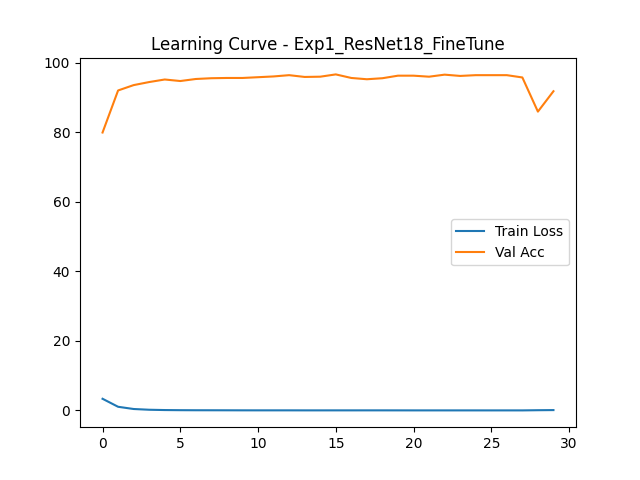
- **분석**: 시작 성능은 우수했으나, 학습 후반부(25 에포크 이후)에 정확도가 급격히 떨어졌다가 다시 복구되는 등 불안정한 양상을 보임. 최종 성능은 약 92% 수준.

### Exp 2: ResNet18 Freeze
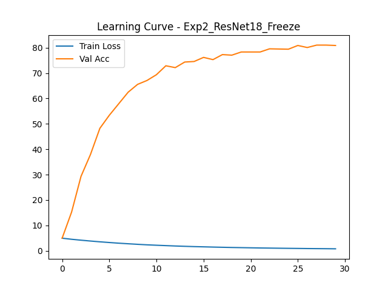
- **분석**: Feature Extractor를 고정하고 출력층만 학습시킨 결과. 정확도는 81% 수준에서 정체되었으나, 그래프의 진동이 거의 없이 매우 안정적으로 학습되었음.

### Exp 3: MobileNet V2 Fine-tuning
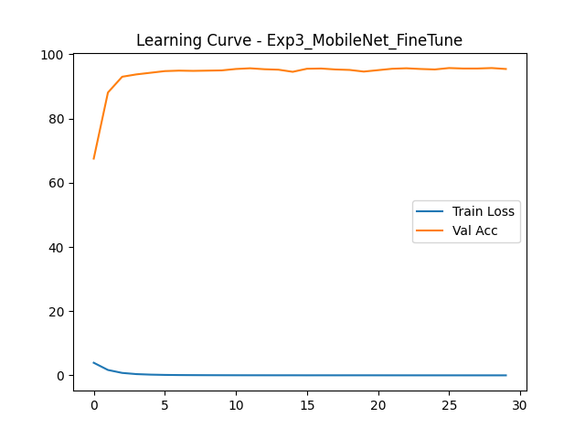
- **분석**: 5 에포크 이내에 90% 정확도를 돌파하며 가장 빠른 수렴 속도를 보였음. 이후 30 에포크까지 **약 95%의 정확도**를 꾸준히 유지하며, 실험군 중 가장 안정적이고 높은 성능을 기록.

### Exp 4: ResNet18 Scratch
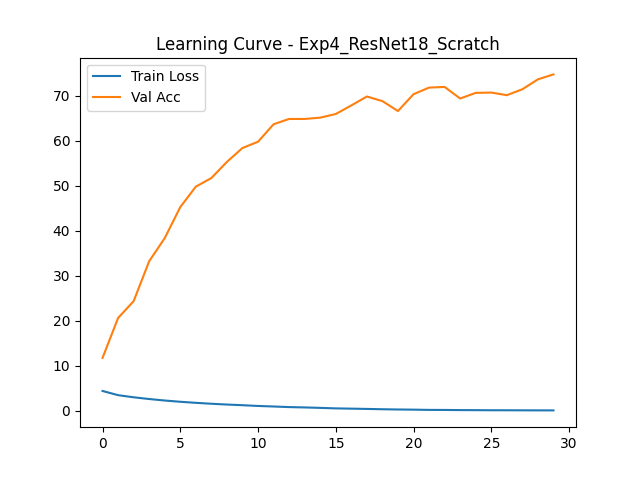
- **분석**: 사전 학습 없이 처음부터 학습한 결과로, 시작 정확도가 10%대로 매우 낮음. 최종 성능 역시 75% 수준에 그쳐, 데이터셋 규모가 작을 때 전이 학습(Transfer Learning)이 얼마나 필수적인지 보여줌.

---

## 3. test 예제 결과
- **GUI 실행 방법 (Streamlit)**

터미널에서 명령어 실행
```streamlit run app.py```

### 실행화면
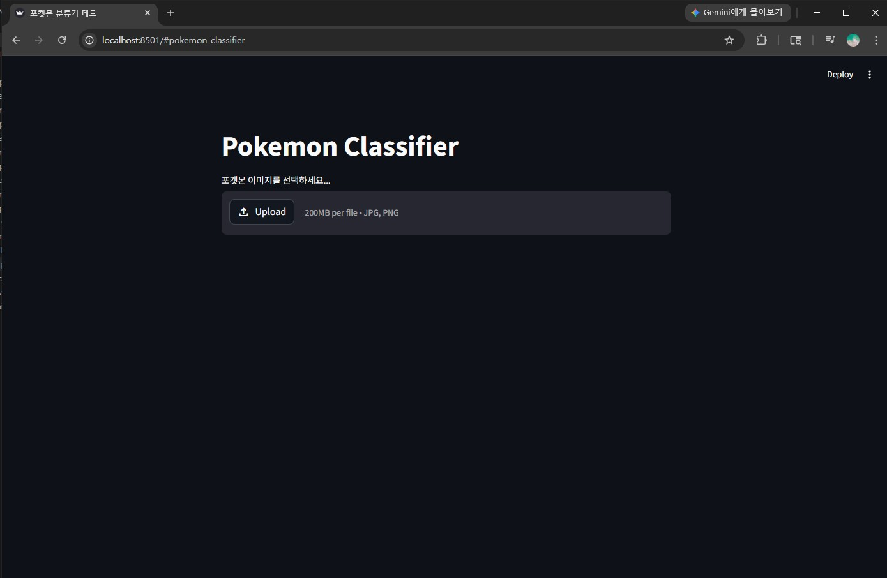

- **test 1 (꼬부기, Squirtle)**


| 실험 번호 | test 예제 출력 결과 |
| :---: | :---: |
| Exp 1 | 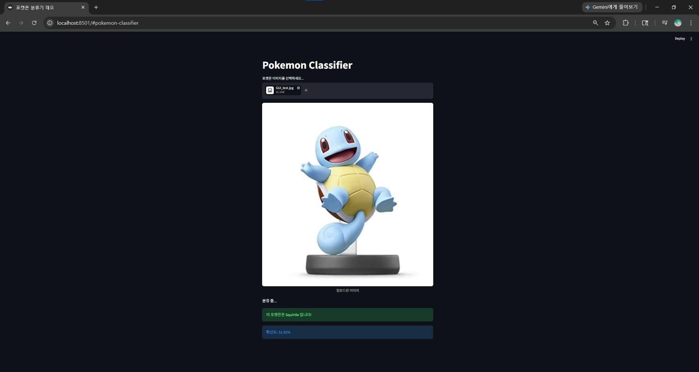 |
| Exp 2 | 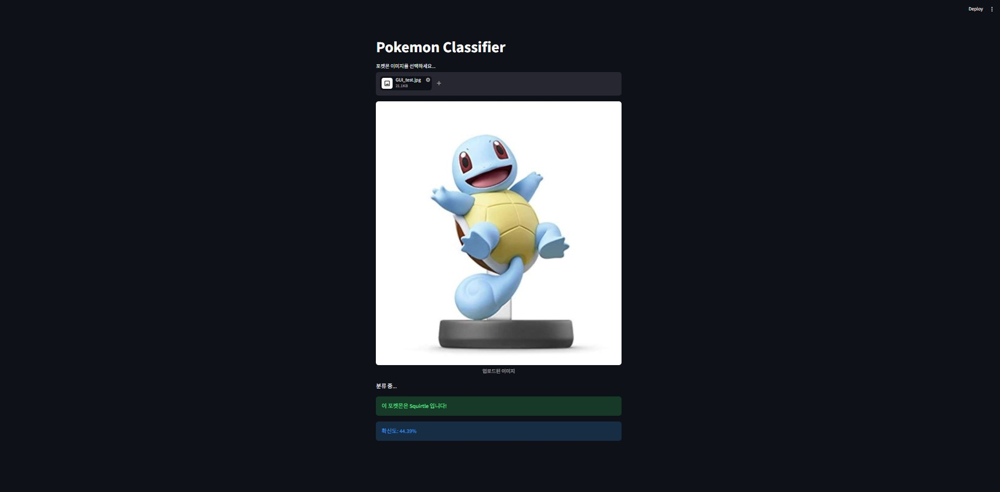 |
| Exp 3 | 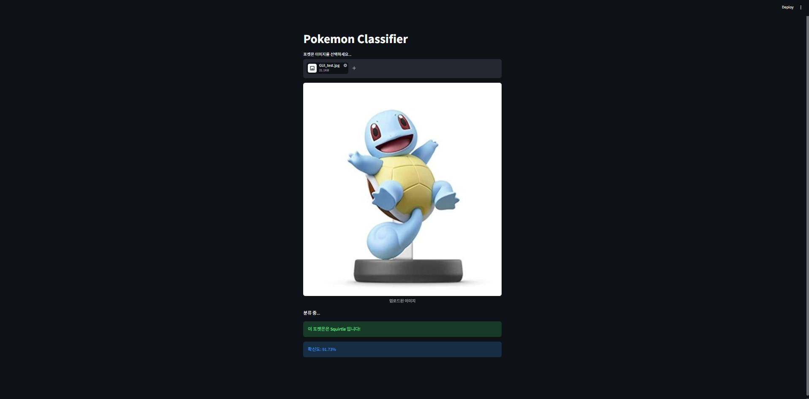 |
| Exp 4 | 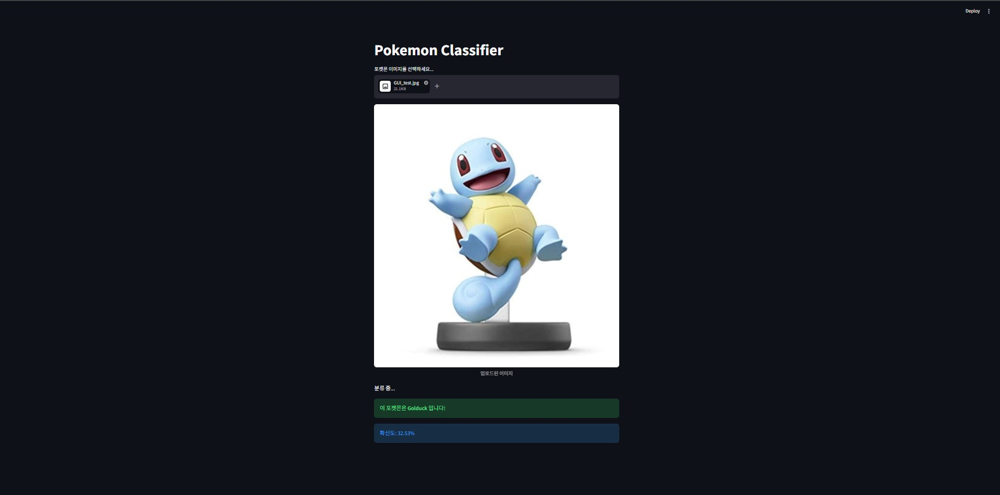 |

- **test 2 (망나뇽, Dragonite)**


| 실험 번호 | test 예제 출력 결과 |
| :---: | :--- |
| Exp 1 | 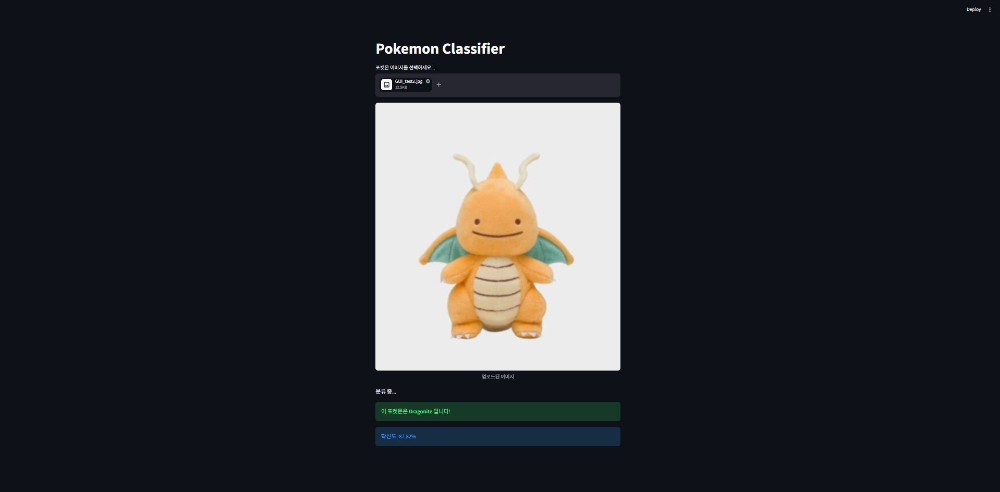 |
| Exp 2 | 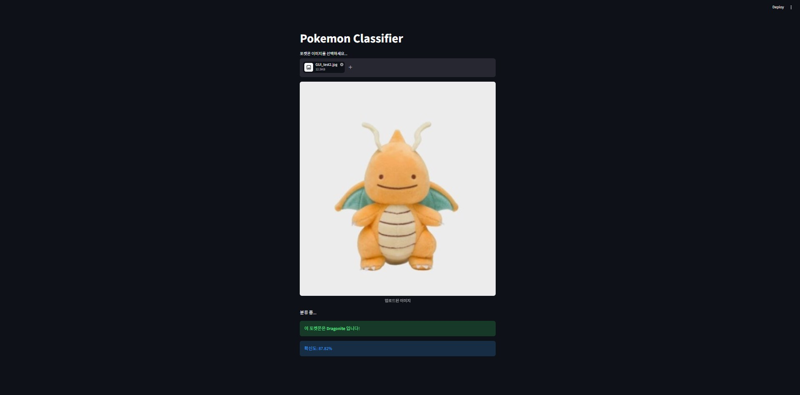 |
| Exp 3 | 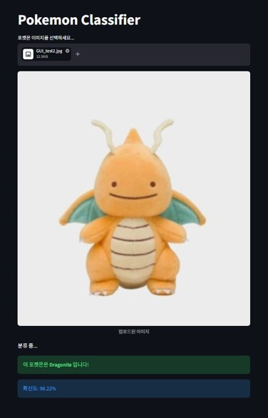 |
| Exp 4 | 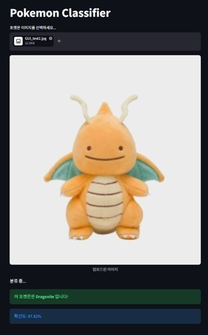 |

- Learning Curves에서 봤던 것처럼 Exp 3에서의 정확도가 높다는 것을 알 수 있음
